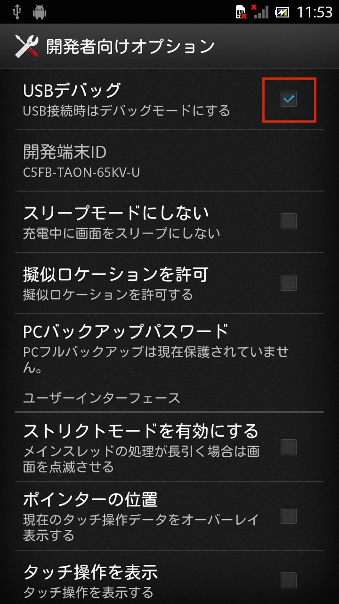

# Ap1.USBデバックモードを有効にする

## Android 4.2 以前のバージョン

設定から開発者向けオプションを選択する。

 

USBデバックにチェックマークをいれる。

## Android 4.2 以降のバージョン
端末情報を選択し、ビルド番号を10回選択すると、デバックモードになる。

開発者向けオプションを選択する。

 

USBデバックにチェックマークをいれる。

