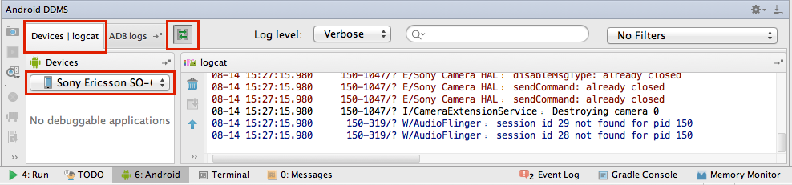
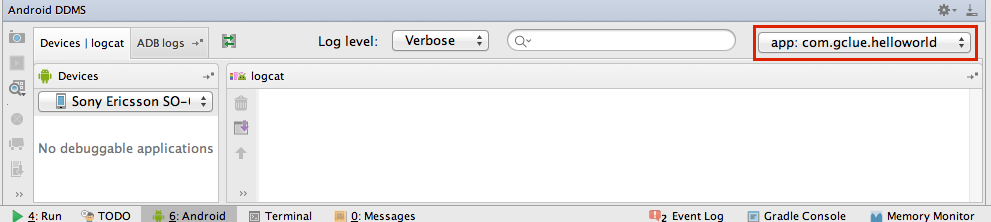
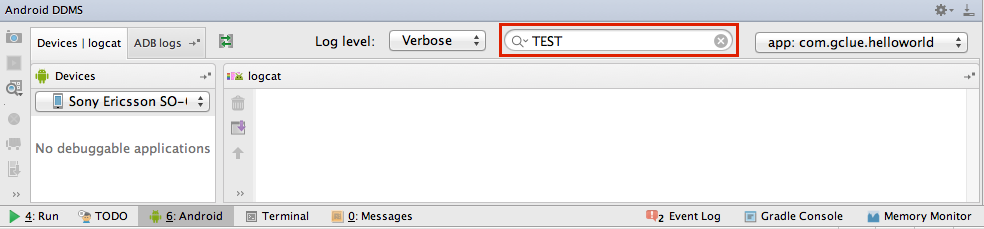
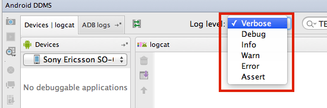

# Appendix2.Logcatでログを見る

## logcatを表示

Devices|logcatを選択し、Devicesに端末が表示されていることを確認する。 を選択し、デバイスに接続する。




## Filter
パッケージ名で、Filterをかけることで、ログを表示するアプリを絞ることができる。



## Keyword
キーワードを入れることで、キーワードに関連するログを表示できる。

```java
Log.d("TEST","MESSAGE");
```



[Reference Log class
](http://developer.android.com/reference/android/util/Log.html)

Log.d以外にも、下記の定義が可能。

```java
Log.v("TEST","MESSAGE");
Log.e("TEST","MESSAGE");
Log.i("TEST","MESSAGE");
Log.w("TEST","MESSAGE");
```



