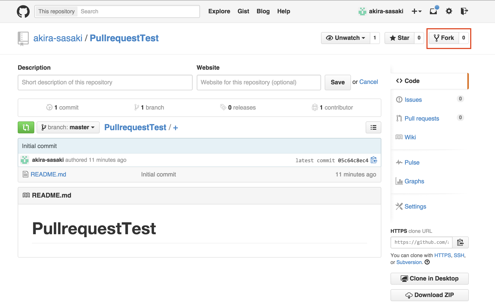
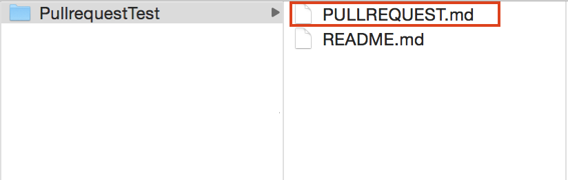
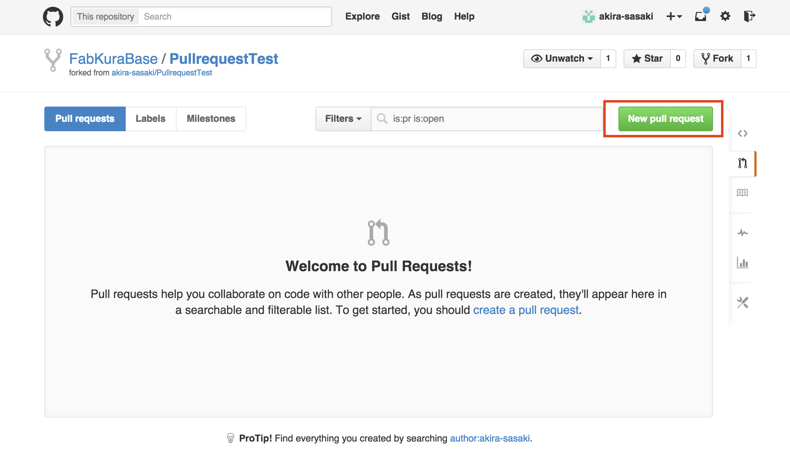
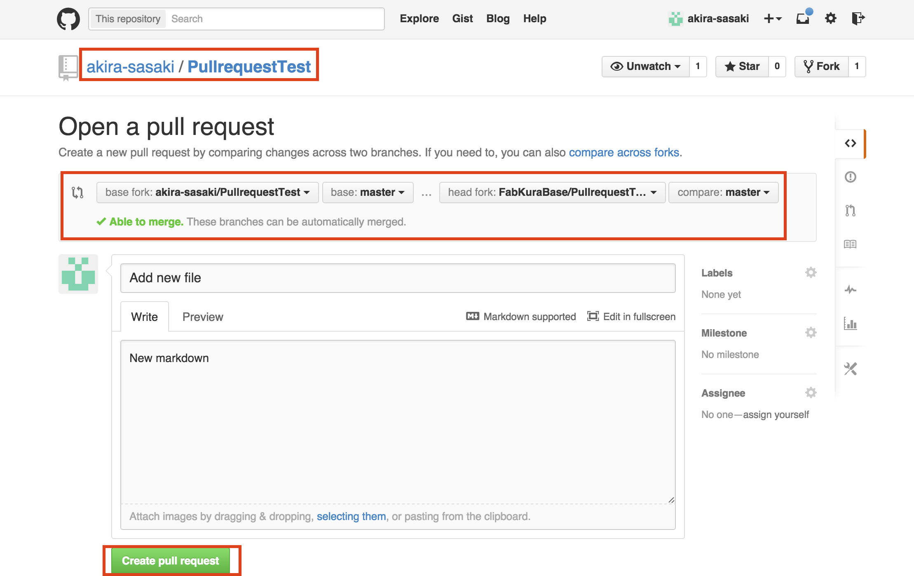

# Appendix6.GithubのPullrequest

## RepoをFork

参加したいプロジェクトのRepoをForkする。

## ForkしたRepoをClone

ForkしたRepoをCloneする。

## ファイルを追加

PULLREQUEST.mdというファイルを追加する。

## ファイルをCommit

ファイルをCommitして、Syncする。

## Pullrequestを発行する

これで、本家のRepoにPullrequestをした事になる。