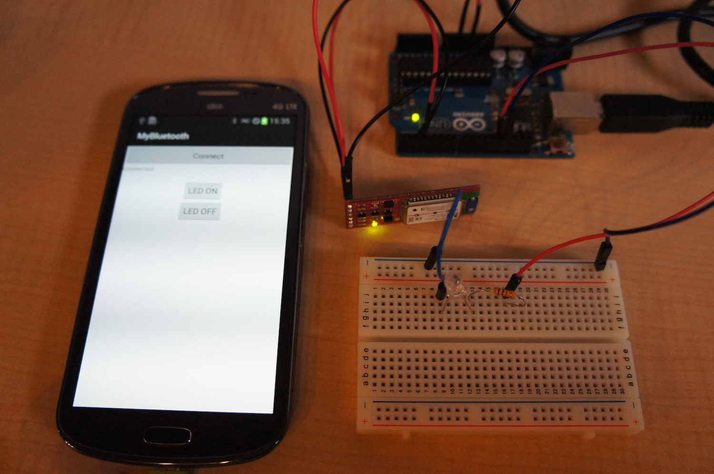
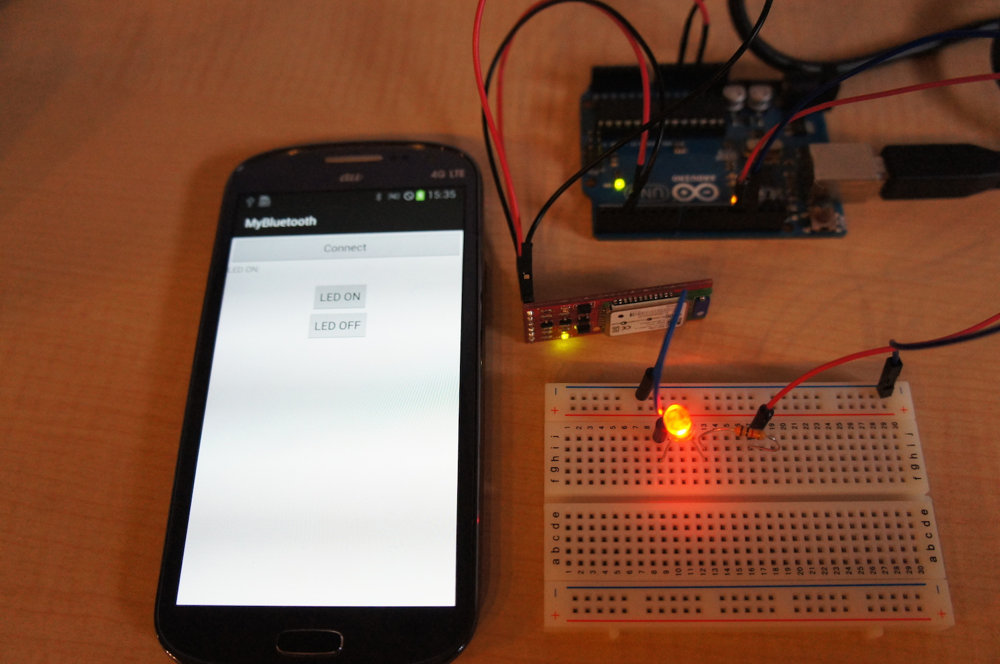

# AndroidからLED操作

今度はスマートフォン側からからArduinoを通してLEDを操作してみましょう。

## Arduino設定

今回LEDしますが、LEDにはプラスマイナスの向きがありますので注意して下さい。
<br>
長い方がプラス(この場合は13ピン)になります。

BrickのLEDの場合は13ピンに接続してください。

### Arduino Uno


#### 回路 (Arduino Uno)


#### スケッチ (Arduino Uno)

```c
#include <SoftwareSerial.h>

SoftwareSerial android(2,3);
// SoftwareSerial android(10,11); // FaBo Brick使用時

int led = 13;   // 13番ピンにてLEDを制御
int inByte = 0; // androidからのテキスト取得用

void setup(){
  // Bluetooth用のシリアルのポートを設定
  android.begin(115200);
  // arduinoのシリアルモニタ用
  Serial.begin(19200); 
  // LEDピンの出力設定
  pinMode(led,OUTPUT);
  Serial.write("init");
}

void loop(){
  
  if(android.available()){
    inByte = android.read();
    Serial.println(inByte);

    // 受信データによりLEDの制御を行う
    if(inByte == 49){
      digitalWrite(led,HIGH);
    } else {
      digitalWrite(led,LOW);
    }

  } 
  
  if(Serial.available()){
    android.write(Serial.read());
  } 
  
}
```

25行目は取得した値の判定を行っています。
<br>
なお、この49という数値はASCIIコードとなっており、49は'1'、48は'0'を表しています。
詳細につきましては以下のサイトをご参照下さい。

e-words 　文字コード表
<br>
http://e-words.jp/p/r-ascii.html

※今回はinByteの変数を数値型(int)にしましたが、char型にすることで49を'1'として扱う事ができます。

### Arduino Mega

#### 回路 (Arduino Mega)


#### スケッチ (Arduino Mega)

```c
int led = 13;    // 13番ピンにてLEDを制御
int inByte = 0; // androidからのテキスト取得用

void setup(){
  // Bluetooth用のシリアルのポートを設定
  Serial1.begin(115200);
  // arduinoのシリアルモニタ用
  Serial.begin(19200); 
  // LEDピンの出力設定
  pinMode(led,OUTPUT);
  Serial.write("init");
}

void loop(){
  
  if(Serial1.available()){
    inByte = Serial1.read();
    Serial.println(inByte);

    // 受信データによりLEDの制御を行う
    if(inByte == 49){
      digitalWrite(led,HIGH);
    } else {
      digitalWrite(led,LOW);
    }

  } 
  
  if(Serial.available()){
    Serial1.write(Serial.read());
  } 
  
}
```

## Android設定

MainActivity.java
```java
package com.gclue.mybluetooth;

import android.bluetooth.BluetoothAdapter;
import android.bluetooth.BluetoothDevice;
import android.bluetooth.BluetoothSocket;
import android.os.Bundle;
import android.os.Handler;
import android.os.Message;
import android.support.v7.app.ActionBarActivity;
import android.util.Log;
import android.view.View;
import android.widget.Button;
import android.widget.TextView;

import com.gclue.mybluetooth.R;

import java.io.IOException;
import java.io.InputStream;
import java.io.OutputStream;
import java.util.Set;
import java.util.UUID;

public class MainActivity extends ActionBarActivity implements Runnable, View.OnClickListener {
    /* tag */
    private static final String TAG = "BluetoothSample";

    /* Bluetooth Adapter */
    private BluetoothAdapter mAdapter;

    /* Bluetoothデバイス */
    private BluetoothDevice mDevice;

    /* Bluetooth UUID */
    private final UUID MY_UUID = UUID.fromString("00001101-0000-1000-8000-00805F9B34FB");

    /* デバイス名 */
    private final String DEVICE_NAME = "RNBT-205F";

    /* Soket */
    private BluetoothSocket mSocket;

    /* Thread */
    private Thread mThread;

    /* Threadの状態を表す */
    private boolean isRunning;

    /** 接続ボタン. */
    private Button connectButton;

    /** LED ONボタン. */
    private Button ledOnButton;

    /** LED OFFボタン. */
    private Button ledOffButton;

    /** ステータス. */
    private TextView mStatusTextView;

    /** Bluetoothから受信した値. */
    private TextView mInputTextView;

    /** Action(ステータス表示). */
    private static final int VIEW_STATUS = 0;

    /** Action(取得文字列). */
    private static final int VIEW_INPUT = 1;

    /** BluetoothのOutputStream. */
    OutputStream mmOutputStream = null;

    /** Connect状態確認用フラグ. */
    private boolean connectFlg = false;

    @Override
    public void onCreate(Bundle savedInstanceState){
        super.onCreate(savedInstanceState);
        setContentView(R.layout.activity_main);

        mInputTextView = (TextView)findViewById(R.id.inputValue);
        mStatusTextView = (TextView)findViewById(R.id.statusValue);
        connectButton = (Button)findViewById(R.id.connectButton);
        ledOnButton = (Button)findViewById(R.id.ledOnButton);
        ledOffButton = (Button)findViewById(R.id.ledOffButton);

        connectButton.setOnClickListener(this);

        ledOnButton.setOnClickListener(this);
        ledOffButton.setOnClickListener(this);

        // Bluetoothのデバイス名を取得
        // デバイス名は、RNBT-XXXXになるため、
        // DVICE_NAMEでデバイス名を定義
        mAdapter = BluetoothAdapter.getDefaultAdapter();
        mStatusTextView.setText("SearchDevice");
        Set< BluetoothDevice > devices = mAdapter.getBondedDevices();
        for ( BluetoothDevice device : devices){

            if(device.getName().equals(DEVICE_NAME)){
                mStatusTextView.setText("find: " + device.getName());
                mDevice = device;
            }
        }

    }

    @Override
    protected void onPause(){
        super.onPause();

        isRunning = false;
        try{
            mSocket.close();
        }
        catch(Exception e){}
    }

    @Override
    public void run() {
        InputStream mmInStream = null;

        Message valueMsg = new Message();
        valueMsg.what = VIEW_STATUS;
        valueMsg.obj = "connecting...";
        mHandler.sendMessage(valueMsg);

        try{

            // 取得したデバイス名を使ってBluetoothでSocket接続
            mSocket = mDevice.createRfcommSocketToServiceRecord(MY_UUID);
            mSocket.connect();
            mmInStream = mSocket.getInputStream();
            mmOutputStream = mSocket.getOutputStream();

            // InputStreamのバッファを格納
            byte[] buffer = new byte[1024];

            // 取得したバッファのサイズを格納
            int bytes;
            valueMsg = new Message();
            valueMsg.what = VIEW_STATUS;
            valueMsg.obj = "connected.";
            mHandler.sendMessage(valueMsg);

            connectFlg = true;

            while(isRunning){

                // InputStreamの読み込み
                bytes = mmInStream.read(buffer);
                Log.i(TAG,"bytes="+bytes);
                // String型に変換
                String readMsg = new String(buffer, 0, bytes);

                // null以外なら表示
                if(readMsg.trim() != null && !readMsg.trim().equals("")){
                    Log.i(TAG,"value="+readMsg.trim());

                    valueMsg = new Message();
                    valueMsg.what = VIEW_INPUT;
                    valueMsg.obj = readMsg;
                    mHandler.sendMessage(valueMsg);
                }
                else{
                    // Log.i(TAG,"value=nodata");
                }

                //Thread.sleep(10);

            }

        }catch(Exception e){

            valueMsg = new Message();
            valueMsg.what = VIEW_STATUS;
            valueMsg.obj = "Error1:" + e;
            mHandler.sendMessage(valueMsg);

            try{
                mSocket.close();
            }catch(Exception ee){}
            isRunning = false;
        }
    }

    @Override
    public void onClick(View v) {
        if(v.equals(connectButton)) {
            if(!connectFlg) {

                mStatusTextView.setText("try connect");

                mThread = new Thread(this);
                // Threadを起動し、Bluetooth接続
                isRunning = true;
                mThread.start();
            }
       } else if(v.equals(ledOnButton)) {
            if(connectFlg) {
                try {
                    mmOutputStream.write("1".getBytes());
                    mStatusTextView.setText("LED ON:");
                } catch (IOException e) {
                    Message valueMsg = new Message();
                    valueMsg.what = VIEW_STATUS;
                    valueMsg.obj = "Error3:" + e;
                    mHandler.sendMessage(valueMsg);
                }
            } else {
                mStatusTextView.setText("Please push the connect button");
            }
        } else if(v.equals(ledOffButton)) {
            if(connectFlg) {
                try {
                    mmOutputStream.write("0".getBytes());
                    mStatusTextView.setText("LED OFF:");
                } catch (IOException e) {
                    Message valueMsg = new Message();
                    valueMsg.what = VIEW_STATUS;
                    valueMsg.obj = "Error4:" + e;
                    mHandler.sendMessage(valueMsg);
                }
            } else {
                mStatusTextView.setText("Please push the connect button");
            }
        }
    }

    /**
     * 描画処理はHandlerでおこなう
     */
    Handler mHandler = new Handler() {
        @Override
        public void handleMessage(Message msg) {
            int action = msg.what;
            String msgStr = (String)msg.obj;
            if(action == VIEW_INPUT){
                mInputTextView.setText(msgStr);
            }
            else if(action == VIEW_STATUS){
                mStatusTextView.setText(msgStr);
            }
        }
    };
}
```


activity_main.xml
```xml
<?xml version="1.0" encoding="utf-8"?>
<LinearLayout xmlns:android="http://schemas.android.com/apk/res/android"
    android:layout_width="fill_parent"
    android:layout_height="fill_parent"
    android:orientation="vertical" >

    <Button android:id="@+id/connectButton"
        android:layout_width="fill_parent"
        android:layout_height="wrap_content"
        android:text="Connect" />

    <TextView
        android:id="@+id/statusValue"
        android:layout_width="fill_parent"
        android:layout_height="wrap_content"
        />

    <TextView
        android:id="@+id/inputValue"
        android:layout_width="fill_parent"
        android:layout_height="wrap_content"
        />

    <Button android:id="@+id/ledOnButton"
        android:layout_width="wrap_content"
        android:layout_height="wrap_content"
        android:layout_gravity="center_horizontal"
        android:text="LED ON" />

    <Button android:id="@+id/ledOffButton"
        android:layout_width="wrap_content"
        android:layout_height="wrap_content"
        android:layout_gravity="center_horizontal"
        android:text="LED OFF" />

</LinearLayout>
```

### 実行確認

Android端末にボタンが表示されますので、「Connect」ボタンを押します。
<br>


Bluetoothモジュールの赤い点滅が消え、緑のランプが点灯しました。
<br>
この状態で「LED ON」ボタンを押します。
<br>


LEDが点灯しました。
<br>
この状態で「LED OFF」ボタンを押すとLEDが消灯しますので、確認してみましょう。


