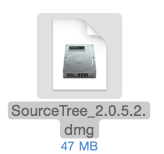

# 環境設定

## JDKのインストール

下記のサイトより環境にあった「Java SE Development Kit 7u79」をダウンロードする。
 
http://www.oracle.com/technetwork/jp/java/javase/downloads/jdk7-downloads-1880260.html

ダウンロードしたファイルを実行し、インストールする。
 
なお、インストール時の設定は初期状態から変更せず行う。

## Android Studioのインストール

Android Studioをダウンロードする。
 
https://developer.android.com/sdk/index.html

ダウンロードした、dmgファイルを実行する。

Android Studio 1.0のインストール画面が表示されるので、Android StudioアイコンをApplicationsにドラッグ&ドロップする。

/Applicationフォルダにインストールされる。

## SourceTreeのインストール

SourceTreeをダウンロードする。
https://www.atlassian.com/ja/software/sourcetree/overview

ダウンロードしたdmgファイルを実行する。

SourceTreeのインストール画面がでるので、SourceTreeアイコンをドラック&ドロップする。

