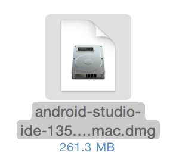

# 環境設定

## JDKのインストール

下記のサイトより環境にあった「Java SE Development Kit 7u79」をダウンロードする。
<br>
http://www.oracle.com/technetwork/jp/java/javase/downloads/jdk7-downloads-1880260.html

ダウンロードしたファイルを実行し、インストールする。
<br>
なお、インストール時の設定は初期状態から変更せず行う。


## Android Studioのインストール

Android Studioをダウンロードする。
<br>
https://developer.android.com/sdk/index.html

ダウンロードした、ファイルを実行する。



※インストール時、PC名やユーザ名に日本語やハイフンなどを使用している場合、「your project location contains non-ascii characters」というエラーメッセージが表示されることがあります。
<br>
その場合はパスに日本語が含まれない場所にフォルダを作成し、そちらを使用してすすめるようにしてください。

Macの場合、Android Studio 1.0のインストール画面が表示されるので、Android StudioアイコンをApplicationsにドラッグ&ドロップする。


/Applicationフォルダにインストールされる。


##環境変数の設定
インストールしたJDKを探す場合に環境変数「JAVA_HOME」を使用する場合がある。
<br>
必要な場合は以下の手順で環境変数の設定を行う。
<br>

###Windowsの場合
1.コントロールパネルを開く

2.システムを選択（表示されていない場合は表示形式を小さいアイコンに変更）

3.詳細設定タブの一番下にある「環境変数」ボタンを押下

4.システム環境変数に「JAVA_HOME」があるかを確認し、ある場合は変更、ない場合は新規を選択

5.変数名にJAVA_HOMEを設定し、変数値にJDKのバージョンが設定されているフォルダのパスを設定

6.設定が終わったら「OK」ボタンを押下

これで設定は完了です。
<br>
コマンドプロンプトにて、下記を入力後enterキー押下で設定したパス名が表示されれば成功です。
```
set JAVA_HOME
```

### Macの場合
Macの場合、JAVA_HOMEが設定されていない場合、下記のコマンドにて表示されたパスが設定されるので、そちらで取得できれば問題ない

```
/usr/libexec/java_home
```
## SourceTreeのインストール

SourceTreeをダウンロードする。
https://www.atlassian.com/ja/software/sourcetree/overview

ダウンロードしたdmgファイルを実行する。


SourceTreeのインストール画面がでるので、SourceTreeアイコンをドラック&ドロップする。


