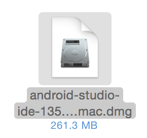
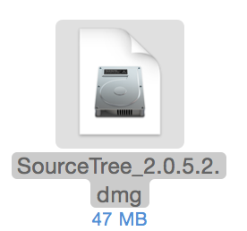

# 環境設定
## Android Studioのインストール

Android Studioをダウンロードする。
http://developer.android.com/sdk/index.html#top

ダウンロードした、dmgファイルを実行する。

Android Studio 1.0のインストール画面が表示されるので、Android StudioアイコンをApplicationsにドラッグ&ドロップする。

## SourceTreeのインストール

SourceTreeをダウンロードする。
https://www.atlassian.com/ja/software/sourcetree/overview

ダウンロードしたdmgファイルを実行する。

