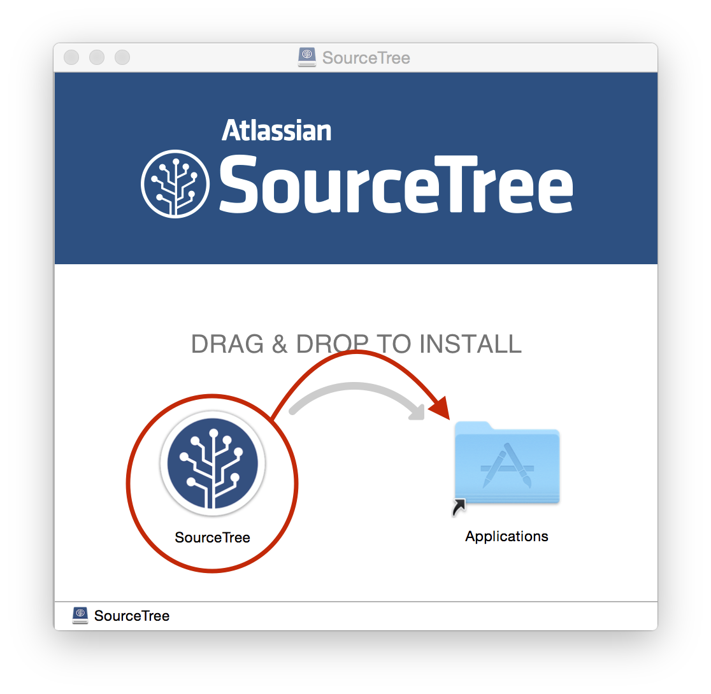

# 環境設定

## Android Studioのインストール

Android Studioをダウンロードする。
https://developer.android.com/sdk/index.html

ダウンロードした、dmgファイルを実行する。

Android Studio 1.0のインストール画面が表示されるので、Android StudioアイコンをApplicationsにドラッグ&ドロップする。

/Applicationフォルダにインストールされる。

## SourceTreeのインストール

SourceTreeをダウンロードする。
https://www.atlassian.com/ja/software/sourcetree/overview

ダウンロードしたdmgファイルを実行する。

SourceTreeのインストール画面がでるので、SourceTreeアイコンをドラック&ドロップする。

