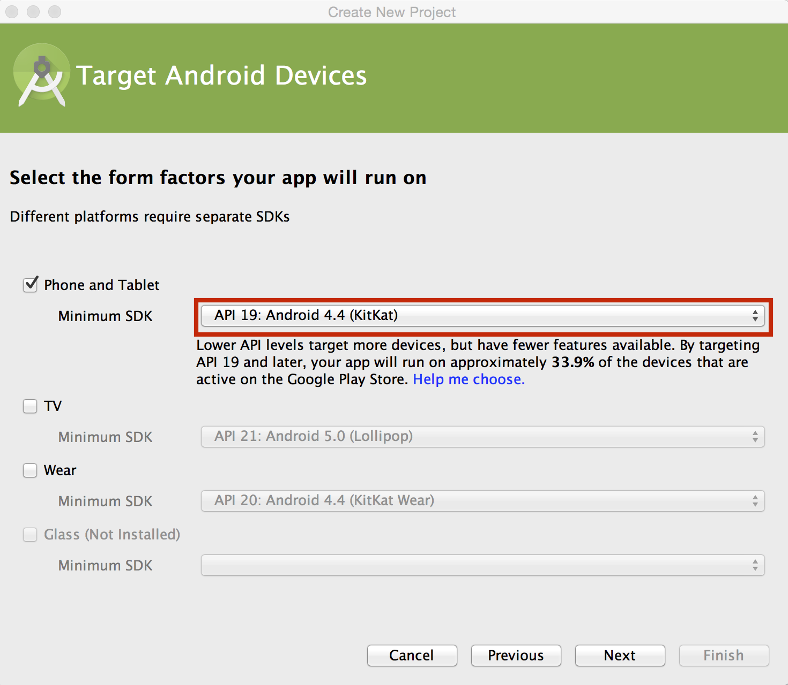
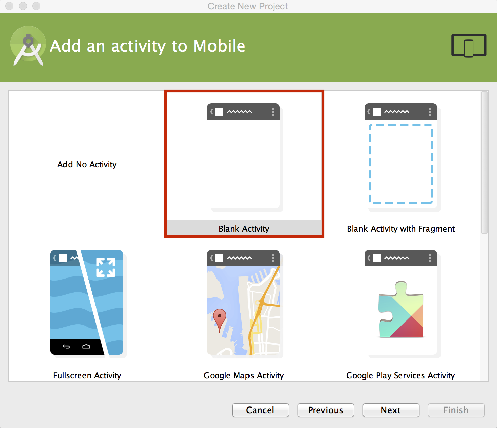
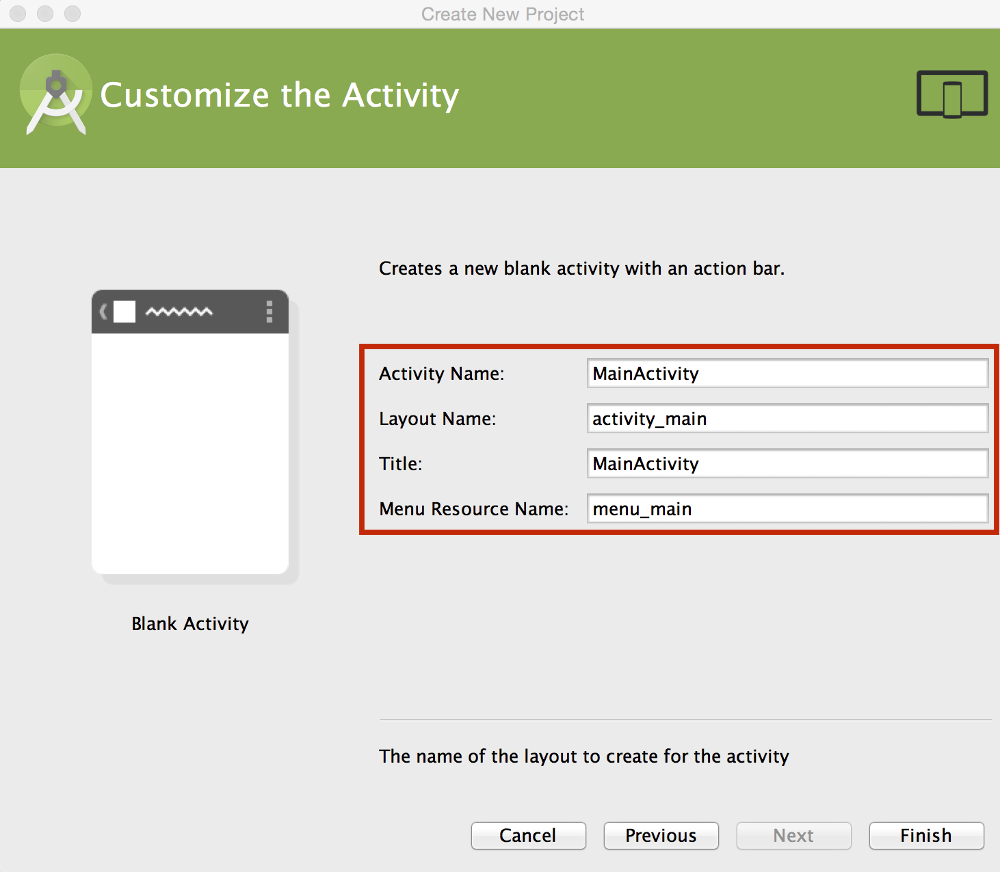
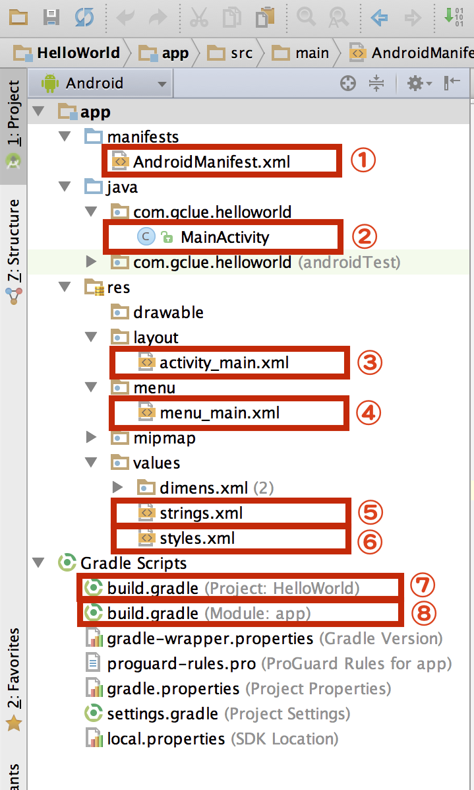

# Hello World

## プロジェクトの作成

Android Studioを起動して、"Start a new Android Studio project"を選択する。


"Create New Project"ダイアログボックスで、Application nameとCompany Domain:を入力する。入力した値は、Package nameの欄にも反映される。

Package nameは、Androidアプリをユニークに識別する値であり、重複すると、Google Playへの登録ができなくなる。

Google Playでは、各アプリの表示はパッケージ名でおこなっている。

[https://play.google.com/store/apps/details?id=***com.gclue.ochineko***](https://play.google.com/store/apps/details?id=com.gclue.ochineko)

また、Project locationでは、プロジェクトを保存する場所を選択する。Macの場合、Document以下にworkspace_プロジェクト名という感じにおくと良い(ここは個人の好み、ルールに従う)。


Phone and TabletnおMinimum SDKでは、サポートする最低レベルのAPIのバージョンを指定する。



どの画面を初期で呼び出すかは、テンプレートから選択する。今回は、Blank Activity を選択する。



最後に、Activity Name等を確認し、[Finish]を押す。

| 項目名 | 内容 |
| -- | -- |
| Activity Name: | Androidアプリの起動時に呼び出されるActivityのクラス名 |
| Layout Name: | Activity Nameで指定したActivityから呼び出されるUIのレイアウトのXMLのファイル名を指定 |
| Title | アプリのタイトルを指定 |
| Menu Resource Name: | Menuで表示するレイアウトのXMLのファイル名を指定



| 番号 | ファイルの内容 |
| -- | -- |
|①| AndroidのManifest情報を記載 |
|②| 起動時に呼ばれるActivity |
|③| ActivityのUIレイアウト |
|④| メニューのUIレイアウト |
|⑤| build.gradle |
|⑥| build.gradle |




AndroidManifext.xml
<loc>
```XML
<?xml version="1.0" encoding="utf-8"?>
<manifest xmlns:android="http://schemas.android.com/apk/res/android"
    package="com.gclue.helloworld" >

    <application
        android:allowBackup="true"
        android:icon="@mipmap/ic_launcher"
        android:label="@string/app_name"
        android:theme="@style/AppTheme" >
        <activity
            android:name=".MainActivity"
            android:label="@string/app_name" >
            <intent-filter>
                <action android:name="android.intent.action.MAIN" />

                <category android:name="android.intent.category.LAUNCHER" />
            </intent-filter>
        </activity>
    </application>

</manifest>
```
</loc>


