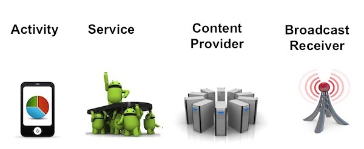

# アプリの種類

Androidでは、画面のあるアプリケーションを開発する場合は、Activityで開発する。Acivity以外に、画面のない常駐型のアプリケーションを開発可能なServiceや、データへのアクセス用のContentsProvider、AndroidからのBroadcastを取得するためのBroadcast Recieverが存在しています。



## Activity

AndroidManifest.xml
```
<?xml version="1.0" encoding="utf-8"?>
<manifest xmlns:android="http://schemas.android.com/apk/res/android"
    package="com.gclue.activitysample" >

    <application
        android:allowBackup="true"
        android:icon="@mipmap/ic_launcher"
        android:label="@string/app_name"
        android:theme="@style/AppTheme" >
        <activity
            android:name=".MainActivity"
            android:label="@string/app_name" >
            <intent-filter>
                <action android:name="android.intent.action.MAIN" />

                <category android:name="android.intent.category.LAUNCHER" />
            </intent-filter>
        </activity>
    </application>

</manifest>

```

activityタグで、囲われた部分に、起動Javaクラス名等を記載する。
```xml
        <activity
            android:name=".MainActivity"
            android:label="@string/app_name" >
            <intent-filter>
                <action android:name="android.intent.action.MAIN" />

                <category android:name="android.intent.category.LAUNCHER" />
            </intent-filter>
        </activity>
```

MainActivity.java
```java
package com.gclue.activitysample;

import android.os.Bundle;
import android.support.v7.app.ActionBarActivity;
import android.view.Menu;
import android.view.MenuItem;


public class MainActivity extends ActionBarActivity {

    @Override
    protected void onCreate(Bundle savedInstanceState) {
        super.onCreate(savedInstanceState);
        setContentView(R.layout.activity_main);
    }
}
```
