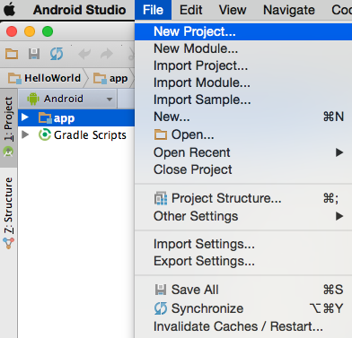

# Activityのライフサイクル

Activityの始まりから終わりまでの、ライフサイクルの解説をおこなう。

## 新規プロジェクトの作成

[File]-[New Project]を選択し、新しいプロジェクトを作成する。

Application nameを設定し、[Next]ボタンを押す。

Minimum SDKのAPIバージョンを設定する。

ActivityはBlack Activityを選択する。

