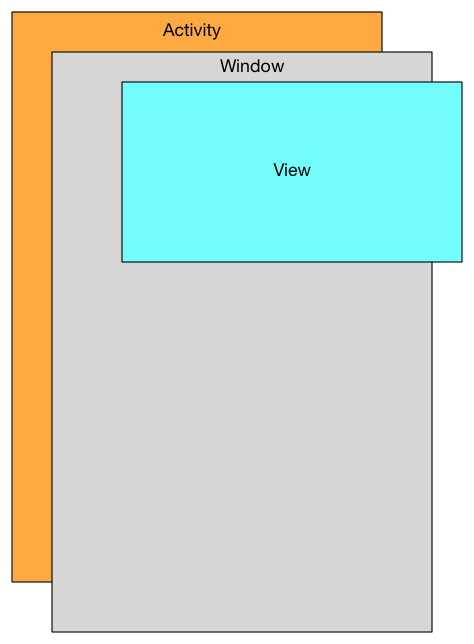
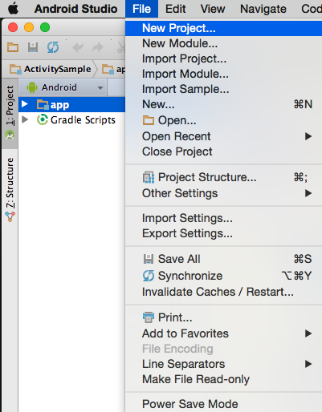
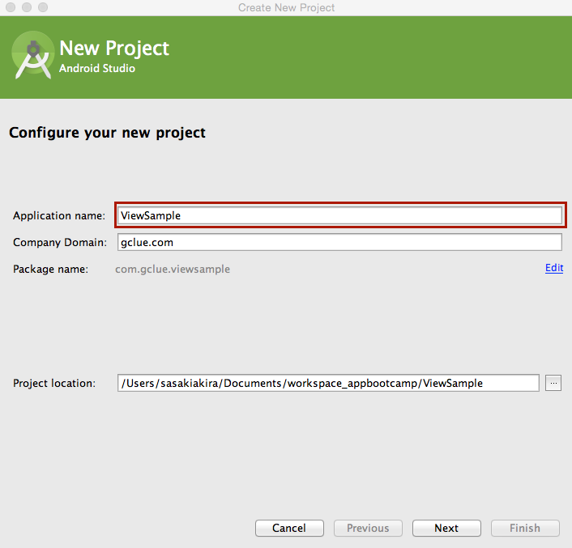
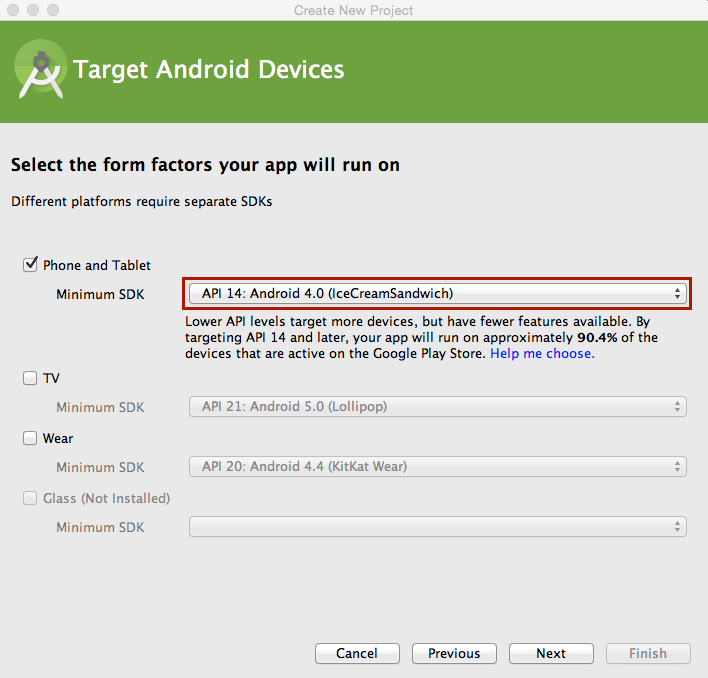
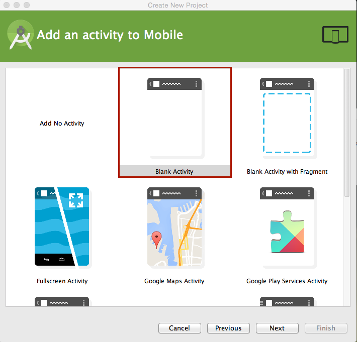
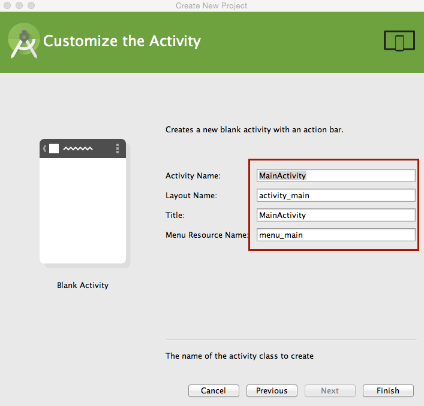

# Viewでの描画処理

## WindowとView

Androidでは、Activityを継承したクラスは、Windoowを保持する。WindowにViewを貼り付ける事で、描画関連の処理をおこなう事ができる。

Viewクラスを継承したクラスは、Window.setContentView() または、Window.addContentView()で、Windowに貼り付けられる。

## 新規プロジェクトの作成

[File]-[New Project]を選択し、新しいプロジェクトを作成する。

Application nameを設定し、[Next]ボタンを押す。

Minimum SDKのAPIバージョンを設定する。

ActivityはBlack Activityを選択する。

