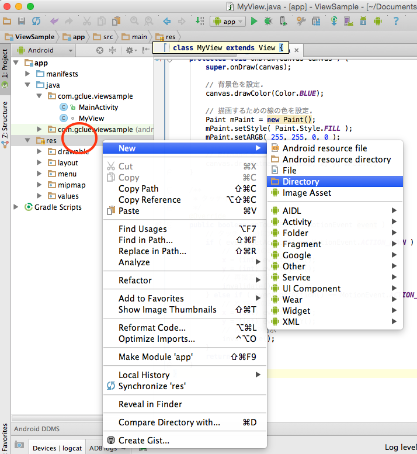

# 音の再生

## 音の用意

Githubより音源をダウンロードしてくる。

[taiko.wav](https://github.com/FabKuraBase/Android-docs/blob/master/res/taiko.wav)

ダウンロードしてきた音声ファイルの上で、CTRL + 右クリックを選択し表示されるショートカットメニューから"taiko.wav"をコピーを選択する。

Android Studioのresフォルダの上で、CTRL + 右クリックを選択し表示されるショートカットメニューから[New]-[Directory]を選択する。

rawという名前のディレクトリを作成する。res/raw

res/rawディレクトリの上で、CTRL + 右クリックで表示されるショートカットメニューで、Pasteを選択する。

移動フォルダを確認し、OKを押して移動が完了する。

# 音の再生

