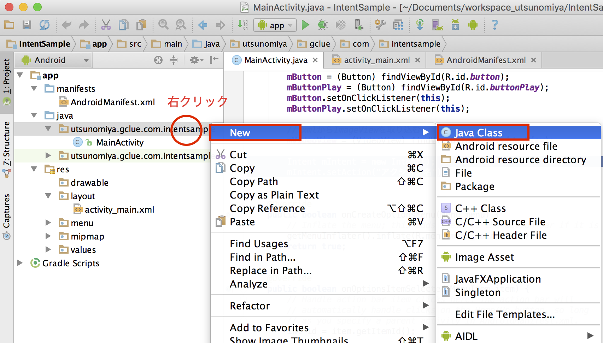

# Intentを作成する


Intentを呼び出す手段

- 明示的なIntent起動
- 暗黙的なIntent起動

があります。明示的なIntent起動では、パッケージ名とクラス名を指定します。明示的なIntentでは、アクション名を指定します。

明示的
```java
Intent selectIntent = new Intent();
selectIntent.setClassName("com.example.intentcooperationsample","com.example.intentcooperationsample.MyActivity");
startActivityForResult(selectIntent, 1);
```
暗黙的
```java
Uri uri = Uri.parse("http://www.gclue.com/");
Intent browserIntent = new Intent(Intent.ACTION_VIEW,uri);
startActivity(browserIntent);
```

AndroidManifest.xml
```xml
<?xml version="1.0" encoding="utf-8"?>
<manifest xmlns:android="http://schemas.android.com/apk/res/android"
    package="utsunomiya.gclue.com.intentsample" >

    <uses-feature android:name="android.hardware.camera" android:required="true" />

    <application
        android:allowBackup="true"
        android:icon="@mipmap/ic_launcher"
        android:label="@string/app_name"
        android:theme="@style/AppTheme" >
        <activity
            android:name=".MainActivity"
            android:label="@string/app_name" >
            <intent-filter>
                <action android:name="android.intent.action.MAIN" />

                <category android:name="android.intent.category.LAUNCHER" />
            </intent-filter>
        </activity>
    </application>

</manifest>
```


Intenr-filterタグでフィルターをかける

            <intent-filter>
                <action android:name="android.intent.action.MAIN" />

                <category android:name="android.intent.category.LAUNCHER" />
            </intent-filter>


# 呼び出し時に呼ばれるメソッド

## 呼び出し側

Intentの記述
```
Intent mIntent = new Intent();
mIntent.setAction("アクション名");
```

Activityを呼び出す
- startActivity(インテント)
- startActivityForResult(インテント)

Serviceを呼び出す
- startService(インテント)

Broadcast
- sendBroadcast(インテント)


# 受信側Activityを作成する




