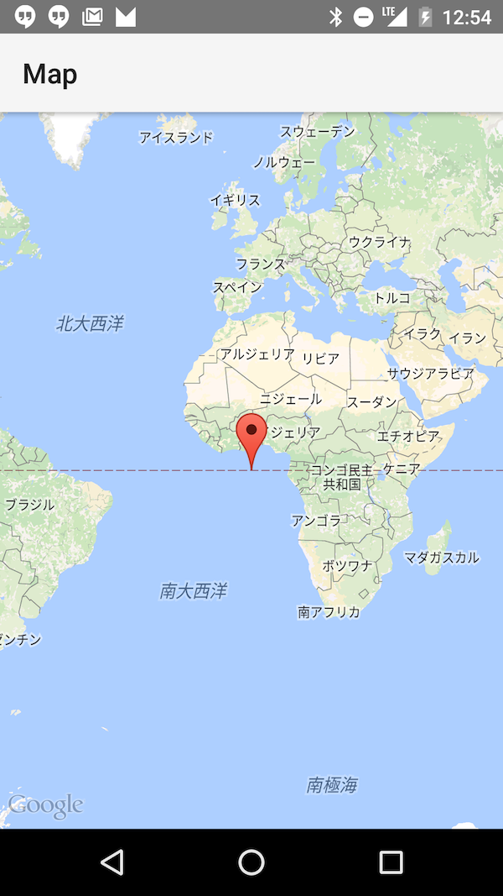

# Mapsのカスタマイズ

## Mapsにキーを埋め込む

AndroidManifest.xmlにキーをコピーします。

キーの実態は、res/values/google_maps_api.xmlに記載します。

アプリを実行するとGoogle Mapsが表示されます。

## 宇都宮大学に座標を移動

    LatLon mLatLon = new LatLng(35.712496928929276, 139.80357825960232)
    CameraUpdate mCameraUpdate = CameraUpdateFactory.newLatLngZoom(mLatLon, 15);
    mMap.moveCamera(mCameraUpdate);